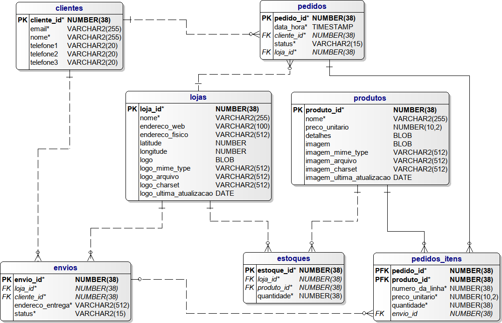

# **BANCO DE DADOS 1**
## **PSET 1**
### - TURMA: CC1MB
### - ALUNO: Vitor Hugo Burns Lessa
### - PROFESSOR: Abrantes Araújo Silva Filho
### - Monitora: Suellen Miranda Amorim

  

## **Introdução:**
*"Um **Problem Set (PSET)** é um conjunto de problemas e tarefas difíceis (alguns extremamente difíceis) que o forçarão a estudar e realmente compreender a matéria."*

 

Usando o **SQL Power Architect** foi replicado o projeto de banco de dados ilustrado abaixo, utilizando o padrão do **PostgreSQL**.

  

 

>Fontes de estudo e consulta para a a realização do projeto:
- **Stack Overflow:** https://stackoverflow.com/
 - **GIT:** https://git-scm.com
 - **ChatGPT:** https://chat.openai.com

 

>Programas utilizados para a execução do trabalho:
- **Visual Studio Code:** https://code.visualstudio.com/
- **Power Architect:** https://dbmstools.com/tools/sql-power-architect
- **DBeaver:** https://dbeaver.io/

  

`Este trabalho foi feito utilizando a máquina virtual DB Server 2.0`

https://www.computacaoraiz.com.br/2023/01/02/dbserver-2/

**Sistema Operacional:**
- CentOS 7 https://www.centos.org/

**Sistema de Gerenciamento de Banco de Dados usado:**
- PostgreSQL 15.1 https://www.postgresql.org/